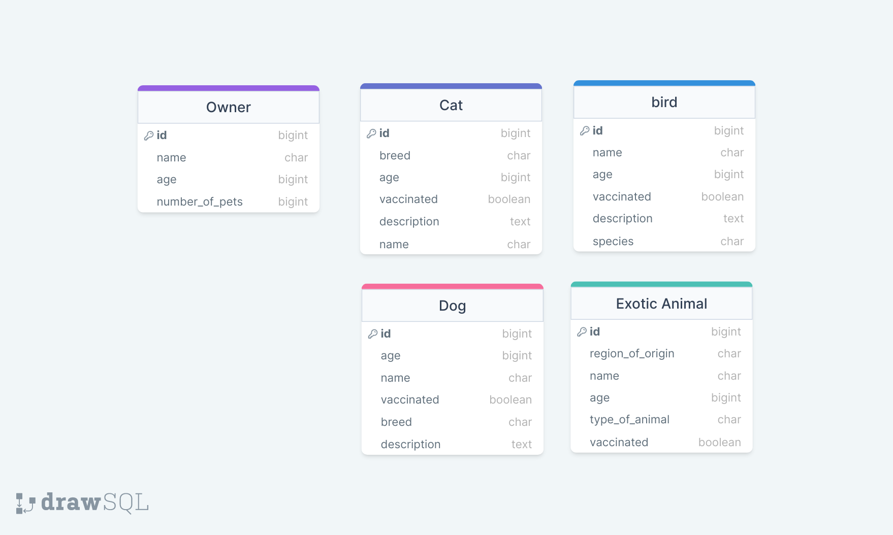

# Pets & Owners

## Exercise

> Create a `Django Project` that does the following:

- Utilizes a `python virtual environment` to store environmental dependencies (i.e. installations)
- Creates a `Django app` and connect it to your `Django Project`
- Connects to a `PostgreSQL` database

> In your `Django App` Create a `Django Model` for each individual table in the immage above. Keep in mind that Postgres only has a limited number of possible field types but remember django offers things like `PositiveIntegerField`, `EmailField`, and many others so please ensure to practice utilizing the field that `BEST FITS` your needs for each columns.
> Lastly, add some data onto each individual field through either the Django Python or the Django Admin site.
