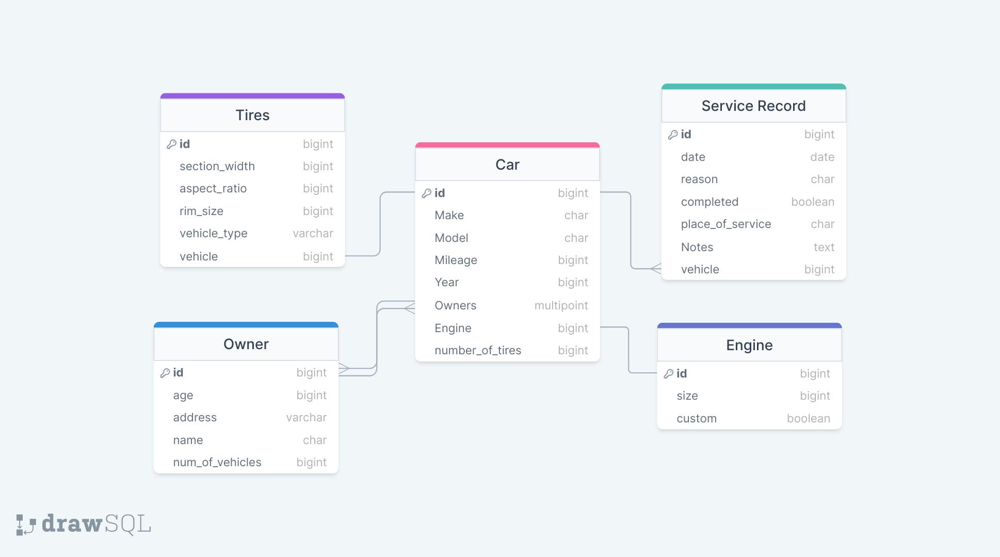

# Cars

## Assignments

In this exercise you will practice your ability to create relationships and validations through out your `Django` projects.

### Set Up

> Start a `Django Project` holding an app for each of the tables in the image above. Ensure all apps and `PostgreSQL` database are correctly installed and connected to your django project.

### Instructions

- Create Models with Validators and Associations

> Utilizing `Dajngo ORM`, replicate the Database schema provided above along with associations and ensure to include any `validators` or custom validators you would like to apply.

- Create Car Instances from the following scenarios
  
  - Vehicle Owners
    - 22 years old Brian lives at 530 K St #1015, San Diego, CA 92101
    - 53 years old Alejandro lives at 1733 W Irving Park Rd #324, Chicago, IL 60613
    - 37 years old Megan lives at 1624 Mankato Ct, Las Vegas, NV 89115
  - Vehicles:
    - 2012 Ford Focus with 53,568 miles, four P225/75R16 tires, and a 4 cylinder
      - Owners:
        - Brian
        - Megan
    - 2016 Chevy Silverado with 18,568 miles, four P255/85R18 tires, and a 6 cylinder
      - Owners:
        - Alejandro
        - Megan
    - 2015 Toyota Camry with 33,568 miles, four P225/75R16 tires, and a 4 cylinder
      - Owners:
        - Megan
    - 2021 Accura TLX with 0 miles, four P225/75R16 tires, and a 6 cylinder custom engine
      - Owners:
        - Brian
        - Alejandro
- Finally create at least 2 service records for each vehicle
