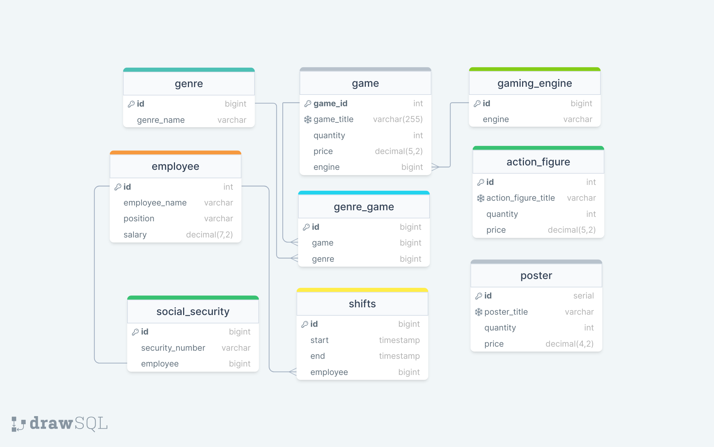

# Game Store IV

The Game Store has it's foundational data now placed within our schema and the owners are very happy with their ability to maintain their database efficiently through PostgreSQL instead of using spreadsheets!

Now the owners want us to take it a step further and gave us the following requirements:

- Add `genres` into our games where many games can have many genres through a connecting table `genre_game`.
- Add `gaming_engine` where many games can belong to one engine.
- Add `social_security` where every employee should have a single ssn entry.
- Add `shift` for employees tracking timestamps for start and end times where an employee can have many shifts.

> Ensure to consider constraints and reference the provided csv data. The image above should give us as developers the main roadmap but the csv data will always be our source of truth. Constraints are important so don't skip them!
